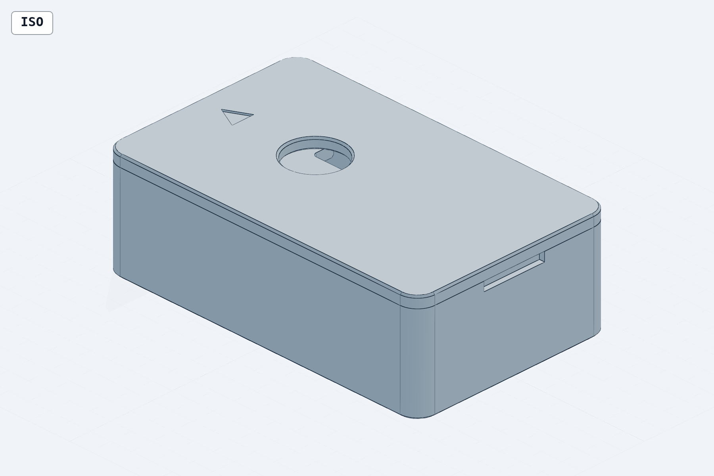
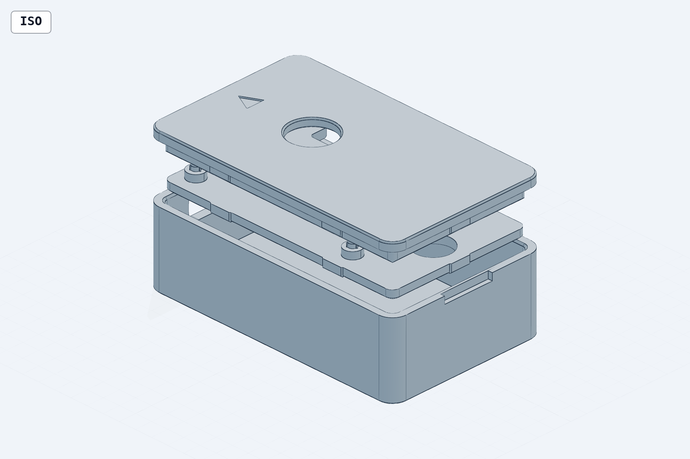

# Plant-Logger Enclosure (FeatherS3D + 503562 LiPo)

Three-part FDM enclosure: **box** (bottom shell), **midplate** (battery lid /
board carrier), **faceplate** (top cap). No fasteners — the midplate friction-fits
into the cavity, the board push-fits onto ribbed posts, and the faceplate lip
plugs into the cavity mouth.

Assembled outer size: **72.8 x 44.8 x 23.3 mm**.

## Coordinate frame (GLOBAL FRAME G)

All coordinates below use frame G:

- **X = 0** at the inner face of the USB-end short wall
- **Y = 0** at the inner face of the long wall nearest the board's mounting-hole row
- **Z = 0** at the cavity floor top surface

Board pose: PCB origin (its 0,0 corner) at G(2.0, 3.0), rotation 0 deg
(USB edge faces the X=0 wall; STEMMA/battery-JST edge faces the Y=40 wall).
PCB bottom Z=10.90, top Z=11.81.

## Files

| File | Description |
|---|---|
| `box.py` / `box.step` / `box.3mf` | Bottom shell |
| `midplate.py` / `midplate.step` / `midplate.3mf` | Battery lid / board carrier |
| `faceplate.py` / `faceplate.step` / `faceplate.3mf` | Top cap |
| `assembly.py` / `assembly.step` | Stacked (assembled) reference model |
| `renders/*.png` | Snapshot renders of each part + assembly views |

## Parts list

| # | Part | Qty | Outline (mm) | Function |
|---|---|---|---|---|
| 1 | box | 1 | 72.8 x 44.8 x 20.9 | Shell; battery bay below Z=6.5; 4 corner gusset standoffs; USB-C slot; pry notch |
| 2 | midplate | 1 | 67.6 x 39.6 x 2.4 | Covers battery; carries board on 3 ribbed push-fit posts; friction-fits via 6 crush ribs |
| 3 | faceplate | 1 | 72.8 x 44.8 x 2.4 (+4.0 lip) | Cap resting on rim; plug lip with 5 crush ribs; 12 mm sensor hole; USB lip relief |

Non-printed: FeatherS3D board, 503562 LiPo (62 x 35 x 5 nom), JST-PH sensor
cable (PHR-4) through the faceplate hole, optional double-sided foam tape for
the battery.

## Assembly instructions (exploded order, bottom to top)

1. **Battery in.** Drop the 503562 LiPo flat on the cavity floor, **wire end
   toward the USB (X=0) wall** — the battery sits at G X 4.0–66.0, leaving
   4.0 mm of wire room at the USB end. It fits under the four corner gussets
   (bay height 6.5 mm). Optional: a patch of double-sided foam tape under it.
2. **Route the battery wires.** Run the leads up along the **Y=40 long wall**
   toward G X≈12.8, where the midplate's U-notch will land.
3. **Midplate in.** Orient it battery-wire-notch toward the Y=40 wall at the
   USB end, finger hole at the far end. Feed the battery JST plug and leads up
   **through the 8.0 x 5.0 notch**, then press the plate down flat onto the four
   gusset tops (Z=6.5). The 6 edge ribs give a light friction fit; the bottom
   perimeter chamfer helps it start.
4. **Board onto posts.** Plug the battery JST into the board first (easier
   outside). Lower the board USB-connector-first toward the X=0 wall, line the
   3 mounting holes over the 3 ribbed pins, and press down evenly until the PCB
   seats on the 4.8 mm shoulders (PCB bottom Z=10.90). Pins protrude 1.0 mm
   above the PCB. Check the **USB-C connector is centered in the wall slot**
   from outside.
5. **Sensor cable.** Plug the JST-PH (PHR-4) sensor cable into STEMMA connector
   #1 (top entry). The plug passes through the faceplate's 12 mm hole, so you
   can connect it before or after capping.
6. **Faceplate on.** Orientation matters: the engraved **triangle points at the
   USB end**. (Rotated 180 deg it still inserts but blocks the USB slot and
   misplaces the sensor hole.) Feed the sensor cable through the 12 mm hole,
   align the lip's 16 mm USB relief over the USB slot, and press the cap down
   until the panel lands on the rim (5 crush ribs hold it).
7. **Opening later:** fingernail in the pry notch on the far short wall to lift
   the faceplate; finger hole (10 mm, far end) to tilt the midplate out.

## Print settings

| Setting | Value |
|---|---|
| Process | FDM, 0.4 mm nozzle, 0.2 mm layers |
| Material | PETG or PLA |
| Supports | **None needed for any part** (13 mm USB slot bridge is printable; gussets are vertical) |
| box orientation | Open side up |
| midplate orientation | Flat, **posts up** |
| faceplate orientation | Flat, **top face down (lip up)** |
| Perimeters | ≥3 walls on midplate and faceplate so the crush ribs and posts are solid perimeter material (friction/press-fit features) |
| Elephant foot | 0.4 mm chamfers already modeled on bottom edges; keep slicer elephant-foot compensation ≤0.1 mm |
| Tolerances (as designed) | ±0.1 mm general; post pattern ±0.05; post/rib dia +0.05/−0 |

All mating fits are FDM-tuned: midplate slide 0.20/side + 0.30 crush ribs, lid
lip 0.15/side + 0.25 crush ribs, board posts loose-bore pins + 0.16–0.20 rib
interference. If fits are too tight, scale rib height in the part `.py` and
regenerate — don't sand the mating walls.

## Key dimensions

### Box

| Feature | Dimension (mm) |
|---|---|
| Outer envelope | 72.8 x 44.8 x 20.9 (G X[−2.4, 70.4], Y[−2.4, 42.4], Z[−2.4, 18.5]) |
| Walls / floor | 2.4 / 2.4 |
| Corner radii | outer R4.0, inner R1.6 |
| Cavity | 68.0 x 40.0 x 18.5 |
| Corner gussets (midplate standoffs) | 4x 45-deg triangles, legs 3.5, height 6.5 (top = midplate seat) |
| Battery bay | full floor, usable height 6.5; battery envelope 62 x 35 at G X[4.0, 66.0], Y[2.5, 37.5] |
| USB-C slot | 13.0 x 8.0, R3.0, in X=0 wall, center G(Y=14.46, Z=13.46); spans Y 7.96–20.96, Z 9.46–17.46; center 15.86 above outer bottom |
| Pry notch | 14.0 wide x 2.0 tall x 1.2 deep, far short wall outer face, open to rim, centered G Y=20.0 |
| Chamfers | 0.5 x 45 deg cavity-mouth lead-in; 0.4 elephant-foot on outer bottom edge |

### Midplate

| Feature | Dimension (mm) |
|---|---|
| Outline | 67.6 x 39.6 x 2.4 (0.20 clearance/side), corner R2.0 |
| Seating | underside on gusset tops at Z=6.5; top at Z=8.9 |
| Friction ribs | 6x vertical crush ribs, 6.0 long x 0.30 proud, tapered ends; long edges at local X=21.0 and 50.0, short edges centered; net 0.10 interference/side |
| Posts (3) | centers G (4.54, 5.54), (4.54, 23.32), (50.72, 5.54); pattern distances 17.78 / 46.18 / 49.49, hold ±0.05 |
| Post shoulder | dia 4.8 x 2.0 tall (sets PCB bottom Z=10.90; clears 5.08 pad keep-out) |
| Post pin | 2.3 nominal dia, 3 axial ribs 0.4 x 0.20 proud → 2.70 effective vs 2.50/2.50/2.54 holes (0.16–0.20 interference); 1.9 above shoulder, lead-in cone to 1.8 over final 0.8; tip Z=12.81 |
| Battery-wire notch | 8.0 wide x 5.0 deep, R1.0, on +Y edge at G X=12.8 (passes 5.9 x 4.5 JST-PH PHR-2 plug) |
| Finger hole | dia 10.0 at G(60, 20) (board-free zone; board far edge G X=53.26) |
| Chamfer | 0.4 on bottom perimeter (insertion lead-in / elephant foot) |

### Faceplate

| Feature | Dimension (mm) |
|---|---|
| Top panel | 72.8 x 44.8 x 2.4, R4.0 — matches box footprint; rests on rim at Z=18.5, top Z=20.9 |
| Plug lip | 67.7 x 39.7 (0.15 clearance/side), R1.45, depth 4.0, ring wall 2.0; lip bottom Z=14.5; 0.5 x 45 lead-in on bottom outer edge |
| USB lip relief | **mandatory** — lip removed over 16.0 span on the USB side, G Y 6.46–22.46 (covers slot Y 7.96–20.96 with 1.5 margin/side) |
| Friction ribs | 5x vertical crush ribs, 6.0 long x 0.25 proud, full lip depth; long sides at local X=19.4 and 52.4, far short side centered; none on USB side; net 0.10 interference/side |
| Sensor hole | dia 12.0 at G(24.33, 20.02), directly above STEMMA connector #1; passes JST-PH PHR-4 plug (10.8 diagonal); 0.4 chamfers both ends |
| Orientation mark | 0.4-deep engraved triangle pointing at the USB end — **install with triangle toward the USB wall** |

### Height stack (Z from cavity floor)

| Level | Z (mm) |
|---|---|
| Cavity floor | 0 |
| Battery bay / gusset top | 0 – 6.5 |
| Midplate | 6.5 – 8.9 |
| Post shoulder (board seat) | 8.9 – 10.9 |
| PCB | 10.90 – 11.81 |
| Post pin tip | 12.81 |
| Faceplate lip bottom | 14.5 |
| Tallest component (battery JST) | 17.40 (headroom to rim: 1.10) |
| Rim / faceplate underside | 18.5 |
| Faceplate top | 20.9 |
| **Total assembled** (incl. 2.4 floor) | **23.3** |

## Verification status

Geometry was independently verified against the STEP files (build123d/OCP
booleans and sections): zero unintended part–part or part–board interference;
all intended crush/press interferences measure exactly as designed; USB slot,
post pattern (0.000 mm error vs measured board holes), lip relief, and sensor
hole all confirmed. Assembly bbox measures exactly 72.8 x 44.8 x 23.3.

Known caveats (non-blocking):

- **Light slot (added 2026-07-27):** 5.0-wide stadium slot through the
  faceplate from G(37.15, 21.17) to G(40.04, 21.00) — directly over the
  ALS-PT19 ambient light sensor AND the adjacent blue status LED
  (positions measured from the vendor STEP). Daylight reaches the sensor
  and the hourly heartbeat blink is visible through the lid. 0.8 top
  chamfer widens the sky acceptance cone; geometry probe-verified open
  over both components with solid webs to the wire hole and lip.
- **Midplate notch vs rib (FIXED post-verification):** the original spec placed
  an edge rib at local X=17.0, partially bridging the battery-wire notch. The
  rib was moved to X=21.0 and the part regenerated + re-probed: the notch now
  has its full 8.0 x 5.0 clear opening (probe shows only the 1.03 mm³ R1 corner
  fillets), and the relocated rib's grip was verified present.
- Spec-note arithmetic quirks (no geometry change needed): battery-corner
  diagonal clearance is 0.71 mm, not the 0.95 stated; finger-hole edge is
  2.8 mm from the far plate edge (the "≥5 mm from plate edges" check is
  unsatisfiable as written); plate corners cover ~45% of each gusset top
  (seating verified flat at Z=6.5 on all four).
- The board STEP actually has a 4th small hole (d2.0 at board 50.26, 21.86);
  it is unused by design — 3 posts only, per the castellated-corner keep-out.
- Sensor hole is centered on the STEMMA opening; the connector *body* bbox
  center is 0.35 mm off in Y — entire connector still projects well inside the
  12 mm hole.

## Renders

| File | View |
|---|---|
| `renders/box_iso.png`, `renders/box_iso_usb.png`, `renders/box_top.png` | Box: iso, iso toward USB wall, top |
| `renders/midplate_iso.png`, `renders/midplate_top.png` | Midplate: iso (posts up), top |
| `renders/faceplate_iso_top.png`, `renders/faceplate_iso_underside.png` | Faceplate: top, underside (lip + USB relief) |
| `renders/assembly_iso.png`, `renders/assembly_front_usb.png`, `renders/assembly_iso_transparent.png`, `renders/assembly_exploded.png` | Assembly: iso, USB-end front, transparent, exploded |
